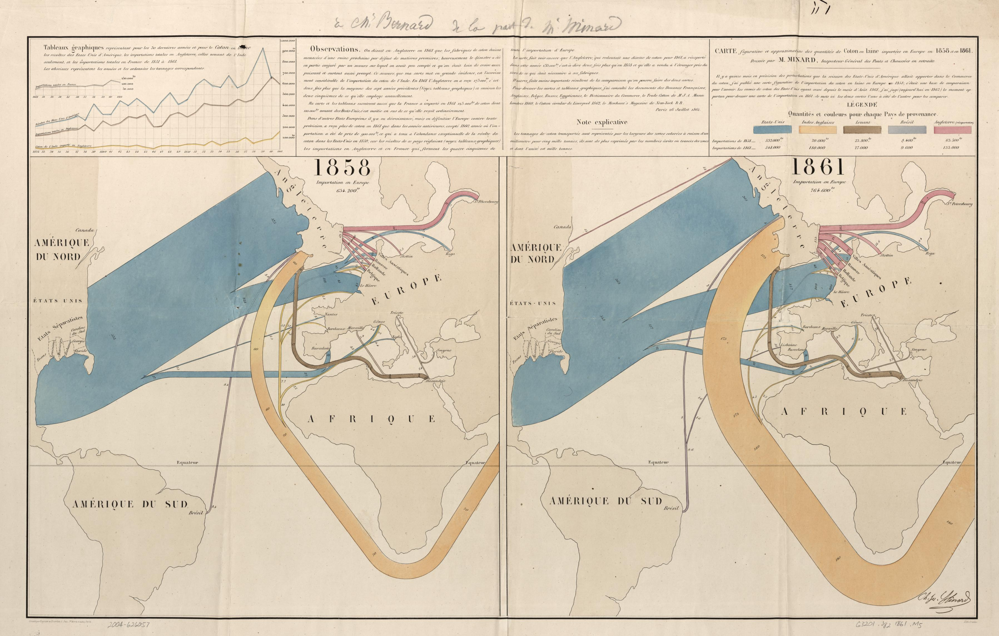
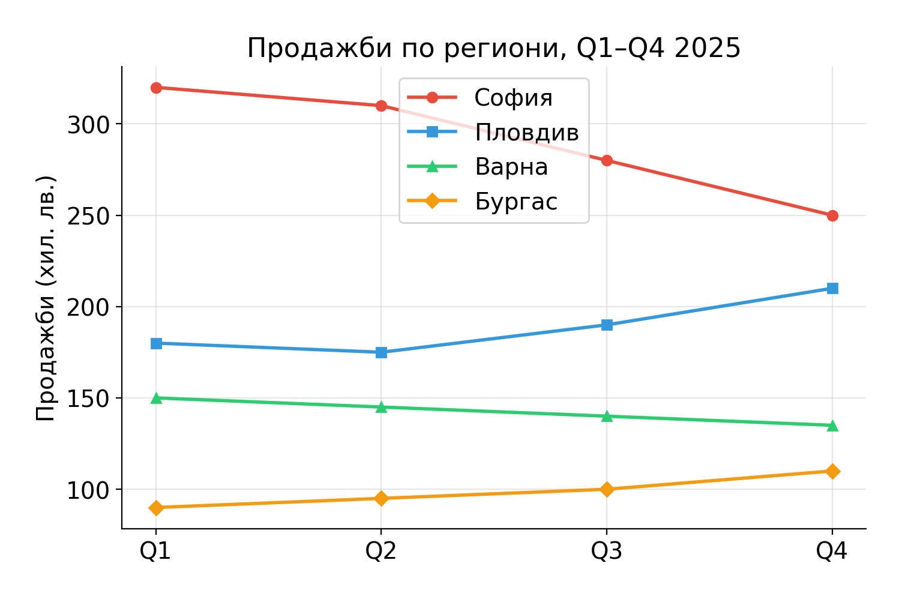
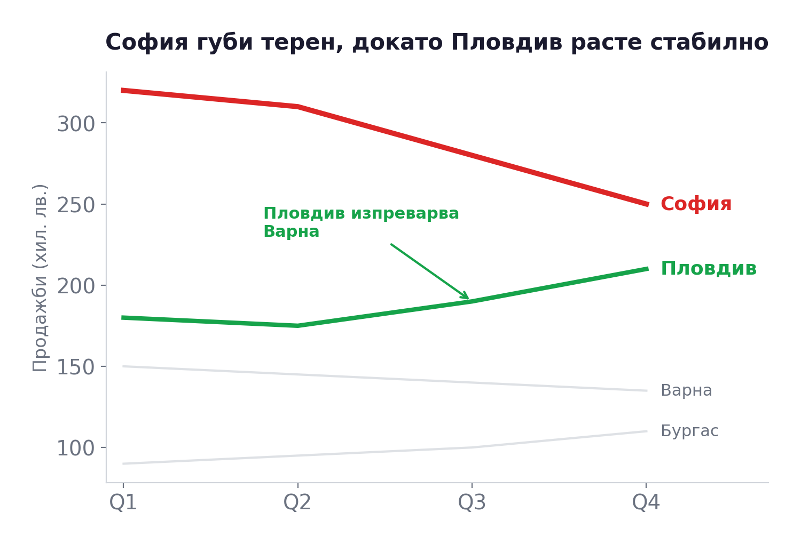
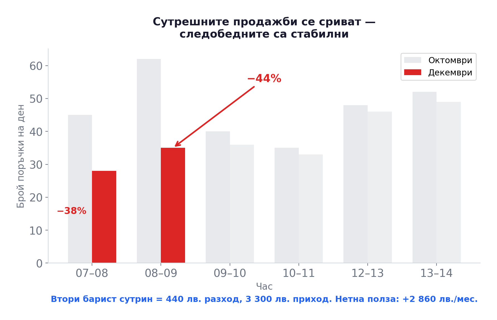

## Къде сме? {.center}

:::{.highlight-box}
**Модул 2: Анализ на бизнеса чрез данни** (Седмици 3–5)

Седмица 3: **Разказване на истории с числа** ← Днес

Седмица 4: Създаване на модели, които имат значение

Седмица 5: Табла за управление, които информират решенията
:::

<br>

В Модул 1 видяхме **защо** данните са важни. Сега се фокусираме върху това **как** да ги превръщаме в убедителни послания.

---

## След тази лекция трябва да можете

- Да избирате графика според бизнес въпроса, а не според навик
- Да превръщате таблица в слайд с ясно **послание** за мениджър
- Да формулирате препоръка, която води към **конкретно действие**

<br>

:::{.highlight-box}
Накрая целта ни не е просто "красива графика", а **аргументирана препоръка** към вземащ решение.
:::

---

## Припомняне: Петте стъпки

```
┌──────────┐   ┌──────────────┐   ┌──────────┐   ┌──────────────┐   ┌──────────┐
│ Събиране │ → │ Организиране │ → │  Анализ  │ → │  Кръстосан   │ → │ Решение  │
│          │   │              │   │          │   │   анализ     │   │          │
└──────────┘   └──────────────┘   └──────────┘   └──────────────┘   └──────────┘
```

<br>

Миналия път стигнахме до **решение** (кафене "Аромат"). Но как го **представяме**, за да убедим някого?

---

## Проблемът

::::{.two-col}

:::{.column}
**Анализаторът:**

- "Направих задълбочен анализ!"
- "Числата са ясни!"
- "Резултатите говорят сами!"
:::

:::{.column}
**Мениджърът:**

- "Какво точно трябва да направя?"
- "Нямам време за 50 реда таблични данни"
- "Не разбирам тази графика"
:::

::::

<br>

:::{.highlight-box}
Данните **никога** не говорят сами. Те имат нужда от **история**.
:::

---

## Защо истории?

Човешкият мозък е създаден за истории, не за таблици:

<br>

| | Факт | История |
|---|---|---|
| **Запомняне** | Голите числа се забравят по-лесно | Историите обикновено се помнят повече и по-дълго ([Chip & Dan Heath, *Made to Stick*](https://heathbrothers.com/books/made-to-stick/)) |
| **Ангажираност** | Таблица с 20 реда → хората спират да четат | Разказ с конфликт → хората искат да знаят края |
| **Действие** | "Продажбите са спаднали с 18%" → "Добре, и?" | "Губим клиенти, защото чакат 15 минути за кафе" → "Нека действаме!" |

<br>

> Данните ви дават достоверност. Историята ви дава влияние.

---

## Същите данни, два начина: Версия "Таблица"

Представете си, че мениджърът ви пита: "Как се развива бизнесът ни в България?"

Изпращате му тази таблица:

<br>

| Регион | Ян | Фев | Мар | Апр | Май | Юни | Юли | Авг | Сеп | Окт | Ное | Дек |
|--------|-----|-----|-----|-----|-----|-----|-----|-----|-----|-----|-----|-----|
| **София** | 340 | 335 | 320 | 310 | 305 | 295 | 280 | 275 | 270 | 260 | 255 | 250 |
| **Пловдив** | 180 | 178 | 175 | 180 | 185 | 190 | 192 | 195 | 200 | 205 | 208 | 210 |
| **Варна** | 150 | 148 | 147 | 145 | 144 | 142 | 141 | 140 | 139 | 138 | 137 | 135 |
| **Бургас** | 90 | 92 | 93 | 95 | 96 | 98 | 99 | 100 | 102 | 105 | 107 | 110 |

<br>

Мениджърът отваря имейла, поглежда... и го затваря - преминава към друга задача.

---

## Същите данни, два начина: Версия "История"

Вместо таблицата, изпращате **едно изречение** и **една графика**:

<br>

:::{.highlight-box}
"София губи по 7–8 клиенти на месец от януари, а Пловдив расте стабилно. Ако тенденцията продължи, Пловдив ще ни изпревари до края на следващата година. Предлагам да преразпределим маркетинг бюджета."
:::

<br>

::::{.two-col}

:::{.column}
**Какво се промени?**

- Същите числа
- Но: ясно послание, конфликт, предложение за действие
- Мениджърът **вижда** проблема вместо да го търси
:::

:::{.column}
**Каква е разликата?**

- Мениджърът не трябва да "разчита" 48 клетки
- Решението е предложено, не загатнато
- Следващата стъпка е ясна
:::

::::

---

## Историята с данни не е ново изобретение

Хората разказват истории с числа от **над 150 години**.

Примерите ни не са някакви нови инструменти за данни — а **нов начин съществуващите данни да се комуникират**.

---

## Пионер 1: Charles Minard и търговията с памук (1866)

::::{.two-col}

:::{.column}
:::{.case-study}
По време на Американската гражданска война (1861–1865) износът на памук от САЩ за Европа **спира почти напълно**. Минар визуализира последствията.
:::

<br>

**Какво показва картата:**

- Дебели сини ленти = потока памук от САЩ
- Лентите се **стопяват** по време на войната
- Нови, по-тънки ленти от Индия и Египет — заместители
- **Една графика** показва глобално преструктуриране на търговията

<br>

:::{.highlight-box}
Минар не е използвал нови данни. Той е **показал** старите по начин, който прави видима цялата история на една глобална криза.
:::
:::

:::{.column}
<br>

::: {.stat-label}
Картата на Минар за вноса на памук в Европа, 1866:
:::

<br>

{fig-align="center" width="100%"}

<br>

[**Вижте картата в оригинал (Library of Congress) →**](https://www.loc.gov/resource/g3201j.ct003179/){target="_blank" style="font-size: 1.0em;"}

<br>

Минар е автор на 51 тематични карти. Известен е с картата на кампанията на Наполеон в Русия, но истинското му наследство е **flow map** — визуализация на потоци от стоки и хора, формат който използваме и днес.
:::

::::

---

## Пионер 2: Hans Rosling и Gapminder

::::{.two-col}

:::{.column}
:::{.case-study}
Шведският лекар и статистик Hans Rosling (1948–2017) прекарва живота си в борба с **едно нещо** — погрешните представи за света, базирани на остарели данни.
:::

<br>

**Неговият подход:**

- Взема **скучни данни** от ООН (БВП, детска смъртност, образование...)
- Създава **анимирани кръгове** — всяка държава е кръг, размерът = население
- **Разказва** историята на живо — с ентусиазъм, хумор и драма
- Резултат: **TED talks с милиони гледания**

<br>

:::{.highlight-box}
"Показах, че най-добрите ми студенти знаят статистически значимо по-малко за света от шимпанзетата." — Hans Rosling, TED Talk (2006)
:::
:::

:::{.column}
<br>

::: {.stat-label}
Интерактивните графики на Gapminder:
:::

<br>

<div style="border: 1px solid #d1d5db; border-radius: 8px; overflow: hidden;">
<iframe src="https://gapminder.org/tools/?embedded=true" width="100%" height="320" frameborder="0" allowfullscreen loading="lazy"></iframe>
</div>

<br>

[**Gapminder Tools →**](https://www.gapminder.org/tools/){target="_blank" style="font-size: 1.0em;"}

<br>

**Опитайте сами:**

1. Отворете линка
2. Натиснете **Play** — гледайте как кръговете се движат от 1800 до днес
3. Намерете **България** — къде сме?

<br>

Данните са от публични източници — основното е в **начина на представяне**.
:::

::::

---

## Какво ни учат примерите?

| Пионер | Данни | Метод | Резултат |
|--------|-------|-------|----------|
| **Minard** (1866) | Търговски статистики, налични за всички | Flow map — потоци върху карта | Една графика показва глобална криза |
| **Rosling** (2006) | Данни на ООН — публични от десетилетия | Анимирани кръгове + лично разказване | Промени как милиони хора мислят за света |

<br>

:::{.highlight-box}
И двамата не са открили **нови данни**. Те са открили **нов начин да ги разкажат**.

Това е силата на data storytelling — тя не е в данните, а в **разказа**.
:::

---

## Триактна структура на историята с данни

```
     Акт 1                    Акт 2                    Акт 3
┌──────────────┐       ┌──────────────┐       ┌──────────────┐
│   КОНТЕКСТ   │  ──→  │  КОНФЛИКТ    │  ──→  │  РЕШЕНИЕ     │
│              │       │              │       │              │
│  Каква е     │       │  Какво       │       │  Какво       │
│  ситуацията? │       │  разкриват   │       │  трябва да   │
│              │       │  данните?    │       │  направим?   │
└──────────────┘       └──────────────┘       └──────────────┘
```

<br>

Помните ли кафене "Аромат"?

- **Контекст:** Приходите падат от 3 месеца
- **Конфликт:** Данните показват 44% спад сутрин — само 1 барист в пиковия час
- **Решение:** Втори барист = +2 860 eur/мес. нетна полза

---

## Тестът "И какво от това?"

Всяко число, всяка графика трябва да премине един прост тест:

<br>

::: {.stat-big}
"И какво от това?"
:::

<br>

::::{.two-col}

:::{.column}
**Без тест:**

"Продажбите сутрин са по-ниски от тези следобед."

*(Добре... и?)*
:::

:::{.column}
**С тест:**

"Сутрешните продажби са спаднали с **44% за 3 месеца**, докато следобедните са стабилни — причината е **1 барист** в пиковия час вместо 2."

*(Ясно — трябва да наемем втори барист сутрин!)*
:::

::::

---

## Пример 1: Spotify Wrapped

::::{.two-col}

:::{.column}
:::{.case-study}
Всеки декември Spotify превръща данните за слушане на всеки потребител в **персонална визуална история** — топ изпълнители, общо минути, жанрове, "слушателска личност".
:::

<br>

**Защо работи?**

- **Контекст:** Твоята година в музиката
- **Конфликт/изненада:** "47 часа Bulgarian folk rock в 2 сутринта?!"
- **Решение:** "Ето коя е твоята музикална идентичност — сподели я!"

<br>

Технически — просто COUNT, SUM и RANK. Но милиони хора го споделят в Instagram. Безплатна рекламна кампания, изградена изцяло от **анализ на данни**.
:::

:::{.column}
<div class="embed-frame">
<iframe src="https://newsroom.spotify.com/2025-12-03/2025-wrapped-user-experience/" width="100%" height="360" frameborder="0" loading="lazy" title="Spotify Wrapped 2025"></iframe>
</div>

:::

::::

---

## Пример 2: COVID-19 тракерът на New York Times

::::{.two-col}

:::{.column}
:::{.case-study}
През 2020–2022 г. ежедневният COVID тракер на NYT стана **задължително четиво** за милиони хора по света.
:::

<br>

Една от най-силните визуализации: **"Една точка = един смъртен случай"**

- Никакви сложни графики
- Никакви проценти или модели
- Само точки, които се трупат

<br>

**Защо е толкова мощно?** Простота, мащаб и човечност — всяка точка е човек, не статистика.

:::{.highlight-box}
"Една смърт е трагедия, милион смърти е статистика." — данните на NYT обръщат тази логика.
:::
:::

:::{.column}
::: {.stat-label}
Отворете интерактивния тракер на NYT:
:::

[**NYT COVID-19 Tracker →**](https://www.nytimes.com/interactive/2023/us/covid-cases.html){target="_blank" style="font-size: 1.1em;"}

:::

::::

---

## Какво обединява добрите примери?

| Принцип | Spotify Wrapped | NYT COVID тракер | Кафене "Аромат" |
|---------|----------------|------------------|-----------------|
| **Прост** | Топ 5 песни, 1 число | Точки на карта | 1 таблица, 1 извод |
| **Личен** | Твоите данни | Твоят град | Твоят бизнес |
| **Води до действие** | Сподели! | Носи маска! | Наеми барист! |
| **Има конфликт** | Изненада за теб | Кризата расте | Губим клиенти |

<br>

:::{.highlight-box}
Добрата история с данни е **проста**, **лична**, **води до действие** и съдържа **конфликт**.
:::

---

## Инструментът на разказвача: визуализацията

Нека поговорим за **графики** — основния инструмент за разказване на истории с числа.

<br>

> "Целта на визуализацията не е да направим данните красиви, а да ги направим **разбираеми**."

<br>

Две ключови решения:

1. **Каква графика** да изберем?
2. **Как да я оформим**, за да разказва история?

---

## Избор на графика: кога коя?

| Искам да покажа... | Подходяща графика | Пример |
|---------------------|-------------------|--------|
| **Сравнение** между категории | Стълбовидна (bar chart) | Продажби по региони |
| **Промяна** във времето | Линейна (line chart) | Приходи по месеци |
| **Част от цялото** | Стълбовидна (stacked bar) | Дял на продуктите в оборота |
| **Връзка** между две величини | Точкова (scatter plot) | Реклама vs. продажби |
| **Разпределение** на стойности | Хистограма | Оценки на клиенти |

<br>

:::{.highlight-box}
**Правило:** Кръговата диаграма (pie chart) рядко е най-добрият избор — човешкото око сравнява дължини по-лесно от ъгли. Използвайте стълбовидна графика вместо нея.
:::

---

## Една и съща информация: Версия А — "Сурова"

*"Ето данните. Какво мислите?"*

```{ojs}
//| echo: false
Plot = import("https://cdn.jsdelivr.net/npm/@observablehq/plot@0.6/+esm")
plotWidth = Math.min(width, 980)

data = [
  {quarter: "Q1", region: "София",   sales: 320},
  {quarter: "Q2", region: "София",   sales: 310},
  {quarter: "Q3", region: "София",   sales: 280},
  {quarter: "Q4", region: "София",   sales: 250},
  {quarter: "Q1", region: "Пловдив", sales: 180},
  {quarter: "Q2", region: "Пловдив", sales: 175},
  {quarter: "Q3", region: "Пловдив", sales: 190},
  {quarter: "Q4", region: "Пловдив", sales: 210},
  {quarter: "Q1", region: "Варна",   sales: 150},
  {quarter: "Q2", region: "Варна",   sales: 145},
  {quarter: "Q3", region: "Варна",   sales: 140},
  {quarter: "Q4", region: "Варна",   sales: 135},
  {quarter: "Q1", region: "Бургас",  sales: 90},
  {quarter: "Q2", region: "Бургас",  sales: 95},
  {quarter: "Q3", region: "Бургас",  sales: 100},
  {quarter: "Q4", region: "Бургас",  sales: 110}
]

Plot.plot({
  width: plotWidth,
  height: 420,
  marginRight: 80,
  style: {fontSize: "14px", fontFamily: "Inter, sans-serif"},
  title: "Продажби по региони, Q1–Q4 2025",
  x: {label: null, padding: 0.2},
  y: {label: "Продажби (хил. лв.)", grid: true},
  color: {
    domain: ["София", "Пловдив", "Варна", "Бургас"],
    range: ["#e74c3c", "#3498db", "#2ecc71", "#f39c12"],
    legend: true
  },
  marks: [
    Plot.lineY(data, {x: "quarter", y: "sales", stroke: "region", strokeWidth: 2.5, tip: true}),
    Plot.dot(data, {x: "quarter", y: "sales", fill: "region", r: 5, tip: true})
  ]
})
```

---

## Една и съща информация: Версия Б — "История"

*"София губи терен, докато Пловдив расте стабилно — трябва да преразпределим ресурсите."*

```{ojs}
//| echo: false
Plot.plot({
  width: plotWidth,
  height: 420,
  marginRight: 90,
  style: {fontSize: "14px", fontFamily: "Inter, sans-serif"},
  title: "София губи терен, докато Пловдив расте стабилно",
  subtitle: "Продажби по региони (хил. лв.), Q1–Q4 2025",
  x: {label: null, padding: 0.2},
  y: {label: "Продажби (хил. лв.)", grid: false},
  color: {legend: false},
  marks: [
    // Background lines — grey and thin
    Plot.lineY(data.filter(d => d.region === "Варна"), {
      x: "quarter", y: "sales", stroke: "#d1d5db", strokeWidth: 1.5
    }),
    Plot.lineY(data.filter(d => d.region === "Бургас"), {
      x: "quarter", y: "sales", stroke: "#d1d5db", strokeWidth: 1.5
    }),
    // Hero lines — bold color
    Plot.lineY(data.filter(d => d.region === "София"), {
      x: "quarter", y: "sales", stroke: "#dc2626", strokeWidth: 4, tip: true
    }),
    Plot.lineY(data.filter(d => d.region === "Пловдив"), {
      x: "quarter", y: "sales", stroke: "#16a34a", strokeWidth: 3.5, tip: true
    }),
    // End labels
    Plot.text(data.filter(d => d.quarter === "Q4"), {
      x: "quarter", y: "sales", text: "region",
      fill: d => d.region === "София" ? "#dc2626" : d.region === "Пловдив" ? "#16a34a" : "#9ca3af",
      fontWeight: d => (d.region === "София" || d.region === "Пловдив") ? "bold" : "normal",
      fontSize: 14,
      dx: 50
    }),
    // Annotation arrow area
    Plot.text([{x: "Q2", y: 240}], {
      x: "x", y: "y",
      text: d => "↓ −22%",
      fill: "#dc2626", fontWeight: "bold", fontSize: 16
    }),
    Plot.text([{x: "Q3", y: 165}], {
      x: "x", y: "y",
      text: d => "Пловдив изпреварва Варна →",
      fill: "#16a34a", fontWeight: "bold", fontSize: 12
    })
  ]
})
```

<br>

Същите числа — но Версия Б **разказва история** и **води до решение**. *Задръжте мишката върху линиите за детайли.*

---

## Как да направите същото в Excel

::::{.two-col}

:::{.column}
{fig-align="center" width="100%"}

<br>

{fig-align="center" width="100%"}
:::

:::{.column}
**Работен процес в Excel:**

1. Поставете данните в tidy таблица: ред = тримесечие, колона = регион
2. Insert -> **Line Chart**
3. Оцветете второстепенните серии в светло сиво
4. Оставете ключовите серии в силен цвят и удебелете линиите
5. Премахнете излишната легенда и излишните gridlines
6. Добавете **заглавие-послание** и 1-2 анотации

<br>

:::

::::

---

## Шест принципа за добра визуализация

Базирани на *Storytelling with Data* (Cole Nussbaumer Knaflic):

<br>

| # | Принцип | Какво означава |
|---|---------|----------------|
| 1 | **Разберете контекста** | Кой гледа? Какво трябва да направи? |
| 2 | **Изберете подходяща визуализация** | Линейна, стълбовидна, точкова — не 3D! |
| 3 | **Премахнете излишното** | Без 3D ефекти, сенки, ненужни линии |
| 4 | **Насочете вниманието** | Цвят и размер — стратегически, не декоративно |
| 5 | **Мислете като дизайнер** | Подредба, бяло пространство, четливост |
| 6 | **Разкажете история** | Заглавие, анотации, послание |

---

## Принцип 3: Премахнете излишното

:::{.case-study}
**Отношение данни–мастило** (data-ink ratio) — концепция на Edward Tufte (1983):

Колкото по-голям процент от "мастилото" на графиката носи **реална информация**, толкова по-добре.
:::

<br>

**Какво да премахнем:**

- 3D ефекти — изкривяват възприятието
- Фонови изображения и текстури
- Излишни линии на мрежата (gridlines)
- Легенда, ако има само 1 серия данни
- Рамка около графиката

<br>

:::{.highlight-box}
**Правило на Tufte:** Ако можете да премахнете нещо, без да загубите информация — премахнете го.
:::

---

## Принцип 4: Насочете вниманието

Цветът е най-мощният инструмент за насочване на вниманието.

<br>

::::{.two-col}

:::{.column}
**Грешка: Дъга от цветове**

Всеки стълб в различен цвят:

- Червено, синьо, зелено, жълто, лилаво...
- Окото не знае **къде** да гледа
- Всичко е еднакво "важно"
:::

:::{.column}
**Правилно: Стратегически цвят**

Всички стълбове в **сиво**, освен един:

- Ключовият стълб — в **синьо** (или червено)
- Окото веднага отива на акцента
- **Послание:** "Погледнете тук!"
:::

::::

<br>

:::{.highlight-box}
**Правило:** Използвайте цвят, за да кажете "**това е важното**", а не за декорация.
:::

---

## Чести грешки при визуализацията

| Грешка | Защо е проблем | Решение |
|--------|----------------|---------|
| **3D графики** | Изкривяват пропорциите | Винаги 2D |
| **Кръгови диаграми** с 8+ категории | Невъзможно да се сравнят | Стълбовидна графика |
| **Двойна Y-ос** | Подвеждаща — мащабът се манипулира | Две отделни графики |
| **Скала, която не тръгва от 0** | Преувеличава разликите | Започнете от 0 (за стълбовидни) |
| **Твърде много данни** на една графика | Информационен шум | Опростете или разделете |

<br>

> "Най-добрата графика е тази, върху която зрителят не се замисля — а веднага вижда посланието."

---

## Заглавието е послание, не описание

::::{.two-col}

:::{.column}
**Описателно заглавие:**

"Продажби по региони, Q1–Q4 2025"

*(Какво да разбера от това?)*
:::

:::{.column}
**Заглавие-послание:**

"София губи 22% от продажбите, докато Пловдив расте стабилно"

*(Ясно! Трябва да действаме.)*
:::

::::

<br>

:::{.highlight-box}
**Правило:** Заглавието на графиката трябва да изразява **извода**, не да описва оста.

Подзаглавието може да съдържа технически детайли (период, мерна единица).
:::

---

## Анотациите разказват историята

Добрата графика не разчита зрителят сам да открие какво е важното:

<br>

**Без анотации:**

- Линейна графика с 4 линии
- Зрителят: "Хм... някои вървят нагоре, други надолу... и?"

<br>

**С анотации:**

- Стрелка при Q3: "Тук Пловдив изпреварва Варна"
- Текст при Q4 София: "−22% спрямо Q1"
- Подчертано поле: "Зона на спад"

<br>

Анотациите са **гласът на разказвача** върху графиката.

---

## Практика: Да разкажем история

Нека приложим наученото. Ще работим с познатите данни от кафене "Аромат":

<br>

**Задача:** Представете си, че трябва да убедите собственика на кафенето да наеме втори барист.

Имате **1 слайд** — една графика и едно изречение.

<br>

::::{.two-col}

:::{.column}
**Стъпка 1:** Изберете какво да покажете

- Продажби по часове?
- Отзиви на клиенти?
- Разход-полза анализ?
:::

:::{.column}
**Стъпка 2:** Оформете го

- Заглавие = послание
- Цвят = акцент
- Без излишно "мастило"
:::

::::

---

## Пример за решение

{fig-align="center" width="80%"}

<br>

Данните са от кафене "Аромат" (Лекция 1). Една графика, едно послание — и мениджърът знае **какво да направи**.

---

## Пълната картина: от данни до история

```
┌──────────┐   ┌──────────────┐   ┌──────────────┐   ┌──────────────┐
│  ДАННИ   │ → │   АНАЛИЗ     │ → │  ИСТОРИЯ     │ → │  ДЕЙСТВИЕ    │
│          │   │              │   │              │   │              │
│ Таблици, │   │ Модели,      │   │ Контекст,    │   │ Мениджърът   │
│ числа    │   │ формули,     │   │ конфликт,    │   │ взема        │
│          │   │ графики      │   │ решение      │   │ решение      │
└──────────┘   └──────────────┘   └──────────────┘   └──────────────┘
```

<br>

:::{.highlight-box}
Анализаторът, който не може да **разкаже** историята, е като писател, който не може да **публикува** книгата си.
:::

---

## Литература и ресурси

**Основна:**

- Cole Nussbaumer Knaflic, *Storytelling with Data* — [storytellingwithdata.com/resources](https://www.storytellingwithdata.com/resources)
- Edward Tufte, *The Visual Display of Quantitative Information* (1983)
- Chip & Dan Heath, *Made to Stick* (2007)

<br>

**Онлайн:**

- [From Data to Viz](https://www.data-to-viz.com/) — интерактивно дърво за избор на визуализация
- [Datawrapper Blog](https://www.datawrapper.de/blog) — практически съвети за графики
- [WTF Visualizations](https://viz.wtf/) — примери за лоши графики (учим от грешките)

---

## Какво ви очаква следващия път?

**Седмица 4: Създаване на модели, които имат значение**

- Преминаваме от визуализация към **моделиране**
- Как да структурираме данни в Excel, за да отговорим на бизнес въпроси
- Формули, pivot tables и първи аналитични модели

---

## Упражнение за вкъщи

:::{.highlight-box}
**Мини-проект:**

1. Изберете **една тема**, която ви интересува (спорт, музика, финанси, храна...)
2. Намерете **реални данни** (Kaggle, НСИ, Eurostat, Google Trends)
3. Създайте **една графика** в Excel, която разказва история
4. Графиката трябва да има:
   - Заглавие-послание (не описание!)
   - Стратегическо използване на цвят
   - Минимум излишни елементи
5. Добавете **едно изречение препоръка**: какво трябва да направи мениджърът?

<br>

**Кое е важното:**

- **Бизнес въпросът** ясен ли е?
- **Избраната графика** помага ли да се види отговорът?
- **Акцентът** насочва ли към най-важното?
- **Препоръката** конкретна ли е и може ли да се изпълни?

Качете в Мудъл до следващата седмица.
:::

---

## Обобщение

Днес видяхме:

- Защо данните имат нужда от **разказвач** — числата не говорят сами
- **Триактната структура:** Контекст → Конфликт → Решение
- Тестът **"И какво от това?"** — всяко число трябва да го премине
- Как да **избираме** правилната графика
- **Шестте принципа** за ефективна визуализация
- Заглавието е **послание**, анотациите са **гласът на разказвача**

<br>

:::{.highlight-box}
Ключов извод: Добрият анализ без добра история е **невидим** анализ.
:::

---

## Въпроси? {.center}

<br>

::: {.stat-big}
?
:::

<br>

доц. д-р Виктор Аврамов | vavramov@nbu.bg
